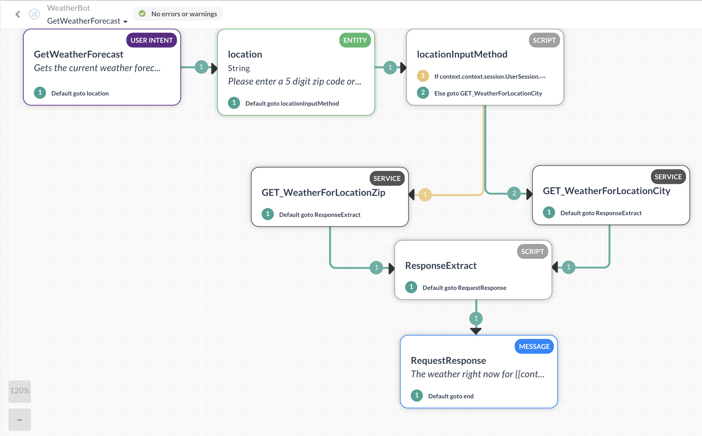

# weatherBot

Fully functioning and trained NLP Kore.AI bot which gets the weather for a location

This demonstration bot was created off the Kore.AI platform.

The intent of the demonstration was to show how quickly a team can put together a feature rich, context sensitive chatbot capable of interpreting user input and responding in kind, reaching out to a third party weather API to retrieve the current weather conditions for a given location.

It allows the user to query the bot for the current weather by either zip code or city/city,state.

The bot will respond to various interpretations of "What is the weather?" that the user may input via the NLP training that was performed.

This includes shorthand queries like "get temp", "what weather", "is it hot", etc.  It even can handle more esoteric utterances such as "Can I put my top down?" for those convertible lovers out there.  

Licensed under GNU GPL v3.0
